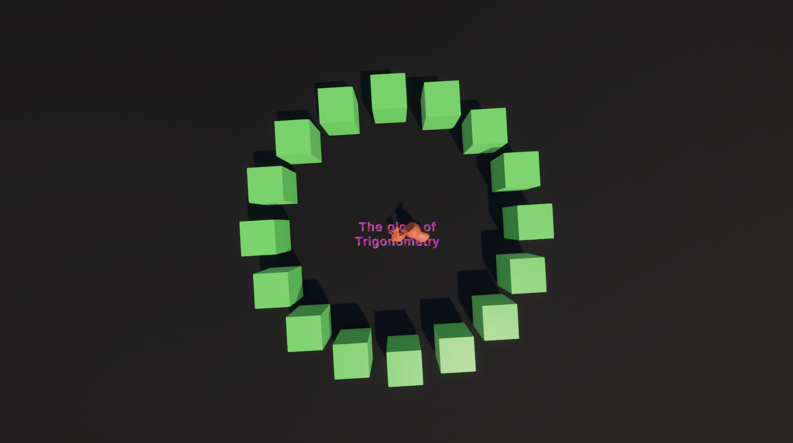

# MonoBehHomework

## Описание

Второе домашнее задание в рамках курса «Продвинутая разработка игр» от TargemGames и Sliva.

## Скриншот

*Скриншот из сцены проекта: взаимодействие игровых объектов с использованием MonoBehaviour.*
